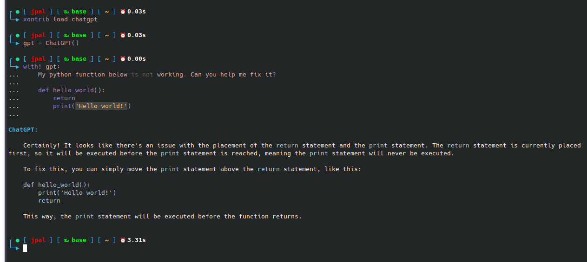

<p align="center">
Gives the ability to use ChatGPT directly from the command line
</p>

<p align="center">
If you like the idea click ⭐ on the repo and <a href="https://twitter.com/intent/tweet?text=Nice%20xontrib%20for%20the%20xonsh%20shell!&url=https://github.com/jpal91/xontrib-chatgpt" target="_blank">tweet</a>.
</p>



## Installation

To install use pip:

```xsh
xpip install xontrib-chatgpt
# or: xpip install -U git+https://github.com/jpal91/xontrib-chatgpt
```

Then use the following command in your `xonsh` shell or add it directly to your `.xonshrc`

```xsh
xontrib load chatgpt
```

### Environment Variables

❗**REQUIRED** ❗
```xsh
# Recommended you put this in your .xonshrc
$OPENAI_API_KEY = <your api key>
```
If you do not have an api key, you can create an account on [OpenAI](https://openai.com/). You will need to add a credit card on file to pay for any of the api usage charges. 

*You are 100% responsible for any and all cost you incur by using this xontrib.* 

For more information on `OpenAI` usage pricing, please go to [OpenAI Pricing](https://openai.com/pricing).

**Optional**
```xsh
$OPENAI_CHAT_MODEL = 'gpt-3.5-turbo'
```
If this is not set, it will default to `gpt-3.5-turbo`. Currently the only accepted options are `gpt-3.5-turbo` or `gpt-4`.

## Usage

`xontrib-chatgpt` was designed to be versatile. To that end, it has capabilities of a `python` function, a `bash`-like function, and a `xonsh` context block.

#### Basic

When loaded, an alias `chatgpt` will automatically be added into your shell. You can use this for simple one-off questions -

```xsh
chatgpt Can you write me a simple 'hello world' function in python?
# ChatGPT responds here
```

#### Context Manager

To carry on a conversation with `ChatGPT`, first assign the `ChatGPT` class to a variable

```py
gpt = ChatGPT()
```

This package extends the built-in `Block` context manager capabilities from `xonsh`, allowing for multi-line inputs to be sent to the `ChatGPT` api

```xsh
with! gpt:
   My python function below is broken, can you help me fix it?

   def hello_world():
      return None
      print('Hello world!')

# ChatGPT responds here
# Any other inputs added will be included in the messages sent to ChatGPT

with! gpt:
   ...
```

#### With Alias

To unlock the full range of conversation options, you can optionally assign an `alias` to the instance -

```xsh
# Best practice is to use the same name as your variable assignment
gpt = ChatGPT(alias='gpt')

# The following is automatically ran for you...
# aliases['gpt'] = lambda args, stdin=None: gpt(args, stdin)

# Then use as a context manager...
with! gpt:
   Hello! Tell me more about yourself.

# Or as an alias function...
gpt Hello! Tell me more about yourself.
echo 'Hello! Tell me more about yourself.' | gpt

# Go crazy with it!
cat my_input.txt | gpt
my_next_input = $(echo 'Hello! Tell me more about yourself')
echo @(my_next_input) | gpt
```

When your variable/conversation is deleted, the registered `alias` is automatically deleted as well

```xsh
del gpt
Deleting alias gpt
```

### Get Help

For class/instance related help -

```xsh
ChatGPT?
gpt = ChatGPT()
gpt?
```

For cli related help
```xsh
chatgpt -h
gpt = ChatGPT()
gpt -h
```

### Additional Capabilities

#### Printing Convo

To print out your conversation to the shell, use one of the following -

```xsh
gpt = ChatGPT('gpt')

gpt.print_convo()
# or
gpt -p
```

See `gpt -h` or `gpt.print_convo?` for additional help and options

#### Saving Convo

To save your current conversation -

```xsh
gpt = ChatGPT('gpt')

gpt.save_convo(path='path/to/my_convo.txt')
# or
gpt -s -P 'path/to/my_convo.txt'
```

See `gpt -h` or `gpt.save_convo?` for additional help and options

#### Loading Convo

You can load a past conversation to a variable using the class method `ChatGPT.fromconvo`

```xsh
gpt = ChatGPT.fromconvo(path='path/to/my_convo.txt', alias='gpt')
```

## Future Plans
- **Chat Manager**
   - Currently, the package has quite a few options for interaction, but some overlap and aren't very concise. The plan is to create a 'one-stop-shop' for interacting with this package in the form of a 'manager' cli function.
   - Ideally from this, you would be able to:
      - Print/load/save conversations
      - Get consolidated 'help' functions (ie get the same info when calling '-h' or '?')
      - Create instances/aliases
      - Monitor and get stats for all active conversations
   - The idea around this being there's one manager who controls everything and you don't have to go searching around for a specific convo, help, instance, alias, etc.
- **Streaming Responses**
   - Expand the ability to get streaming responses on the command line as opposed to waiting until the full completion is done


## Credits

This package was created with [xontrib template](https://github.com/xonsh/xontrib-template).

