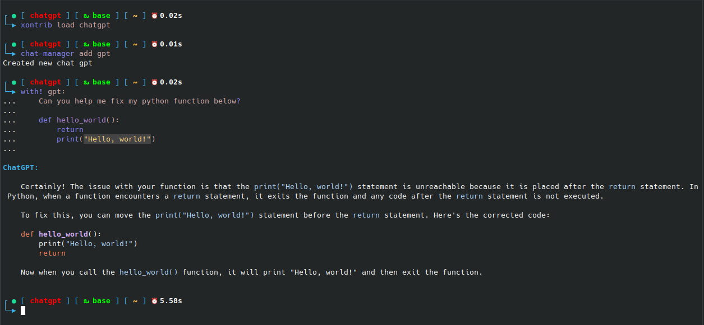

<p align="center">
Gives the ability to use ChatGPT directly from the command line
</p>

<p align="center">
If you like the idea click ⭐ on the repo and <a href="https://twitter.com/intent/tweet?text=Nice%20xontrib%20for%20the%20xonsh%20shell!&url=https://github.com/jpal91/xontrib-chatgpt" target="_blank">tweet</a>.
</p>



## Installation

To install use pip:

```xsh
xpip install xontrib-chatgpt
# or: xpip install -U git+https://github.com/jpal91/xontrib-chatgpt
```

Then use the following command in your `xonsh` shell or add it directly to your `.xonshrc`

```xsh
xontrib load chatgpt
```

### Environment Variables

❗**REQUIRED** ❗
```xsh
# Recommended you put this in your .xonshrc
$OPENAI_API_KEY = <your api key>
```
If you do not have an api key, you can create an account on [OpenAI](https://openai.com/). You will need to add a credit card on file to pay for any of the api usage charges. 

*You are 100% responsible for any and all cost you incur by using this xontrib.* 

For more information on `OpenAI` usage pricing, please go to [OpenAI Pricing](https://openai.com/pricing).

**Optional**
```xsh
$OPENAI_CHAT_MODEL = 'gpt-3.5-turbo'
```
If this is not set, it will default to `gpt-3.5-turbo`. Currently the only accepted options are `gpt-3.5-turbo` or `gpt-4`.

## Usage

**NEW in Version 0.1.3**

Use `chat-manager` to easily create and manage new chats

```xsh
chat-manager add gpt
gpt "Hello, what's your name?"
# ChatGPT responds here
```

Use your chat as a callable alias or `xonsh` context block

```xsh
echo "Hello, what's your name" | gpt
gpt < input.txt
echo @(myvar) | gpt

# The entire contents of the block is sent as text to ChatGPT
with! gpt:
   Can you help me fix my python function?

   def hello_world():
      return
      print('Hello, world!')
```

To get see more CLI options:

```xsh
chat-manager -h
```

To get a quick tutorial:

```xsh
chat-manager help
# or
chat-manager?
```

⭐ **BONUS**: If [xontrib-abbrevs](https://github.com/xonsh/xontrib-abbrevs) is loaded, use `cm` to expand to `chat-manager`

#### Version 0.1.3 Notes
- `chat-manager` is meant to replace prior direct usage of utilizing the `ChatGPT` python class directly
- Direct usage of `ChatGPT` will not be deprecated, yet, but the plan is to have `chat-manager` be the defacto usage of this package
- `chat-manager` is also getting passed to the global ctx for debugging purposes for now as `chat_manager`, but will later be deprecated
- The one-off alias `chatgpt` is also available, but will be deprecated in later versions
- To see the original documentation on these, please visit the [old usage](/docs/old_usage.md) docs
- Three new `xonsh` events were added to help manage changes see [events](/docs/events.md) for details

## Future Plans
- **Streaming Responses**
   - Expand the ability to get streaming responses on the command line as opposed to waiting until the full completion is done
- **Chat Settings**
   - Allow customizable max tokens
   - Allow each chat to have separate models (ie 3.5-turbo, 4, etc.)
   - Timeouts on long responses
- **Additional Models**
   - Open up the ability to use other models besides 3.5 and 4
- ~~**Completions**~~ **NEW in v0.1.5**
   - ~~Helper completions for `chat-manager`~~


## Credits

- This package was created with [xontrib template](https://github.com/xonsh/xontrib-template).
- [Xonsh Documentation](https://xon.sh/contents.html)
- [prompt_toolkit](https://python-prompt-toolkit.readthedocs.io/)
- [Pygments](https://pygments.org/docs/)
- [Awesome Xontribs](https://github.com/xonsh/awesome-xontribs) - Much inspiration was taken from many projects in this fantastic repo

